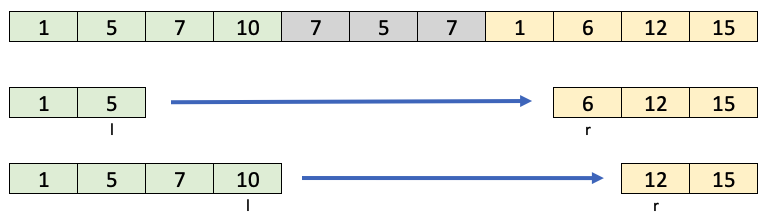

[1574. Shortest Subarray to be Removed to Make Array Sorted](https://leetcode.com/problems/shortest-subarray-to-be-removed-to-make-array-sorted/)

```txt
So, we can break this problem into the following subproblems:

- Find the longest non-decreasing continuous subarray starting from the left.
- Find the longest subarray ending at the right.
- Make the longest non-decreasing sequence from the left and right array.
```

In the picture below, you can see left and right subarrays, and two ways to connect them in a non-decreasing sequence.

##### Algorithm



```txt
- We can use the two pointers pattern to find the best split between left and right subarrays:
- First, find out the longest non-increasing sequence in the right part of the array. r will point to the first element of that sequence.
- Now, go left-to-right, and for each l increment r while n[r] < n[l].
- Track the minimum length between left and right in res.
Break if n[l] < n[l - 1]. The left sequence is no longer non-decreasing.

```

##### Note

- our ans. can be only either in starting or at ending.
- can'nt in between, else we would have to remove 2 subarrays.

[source](<https://leetcode.com/problems/shortest-subarray-to-be-removed-to-make-array-sorted/discuss/833271/C%2B%2B-with-picture-O(n)>)

```cpp
int findLengthOfShortestSubarray(vector<int>& arr) {
    int n = arr.size();
    int low = 0;
    int high = n - 1;
    while (low < n - 1 && arr[low] <= arr[low + 1]) low ++;
    while (high - 1 >= 0 && arr[high - 1] <= arr[high]) high --;

    int ans = min(n - low - 1, high);
    if (ans == 0) {
        return ans;
    }

    int i = 0;
    int j = high;

    while (i <= low && j < n) {
        if (arr[i] <= arr[j]) {
            ans = min(ans, j - i - 1);
            i ++;
        } else {
            j ++;
        }
    }
    return ans;
}
```
