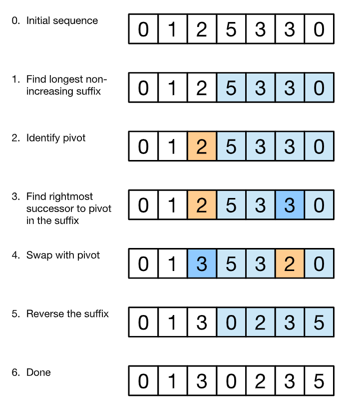

[31. Next Permutation](https://leetcode.com/problems/next-permutation/)



[Picture source](https://leetcode.com/problems/next-permutation/discuss/13994/Readable-code-without-confusing-ij-and-with-explanation)

### NOTE

- suffix means starting from the end of the string.
- pivot means the point till where the logic was following.

#### what is next permutation

- let say we are standing on the particular index.
- now we want to make some no. which is just greater then current one.
- from index `i + 1` i will search till end of array, if i am able to find just greater element then `i th`.
- will swap the two.

```cpp
class Solution {
    public:
    void nextPermutation(vector<int>& arr) {
        int n = arr.size();
        int i = n - 2;
        for (; i >= 0 && arr[i + 1] <= arr[i]; i--) { }
        if (i < 0)
            reverse(arr.begin(), arr.end());

        else {
            int j = i + 1;
            int k = -1;
            for (int j = i + 1; j < n; j++)
                if (arr[i] < arr[j])
                    k = j;
            if (k >= 0)
                swap(arr[i], arr[k]);
            reverse(arr.begin() + i + 1, arr.end());
        }
    }
};
```
